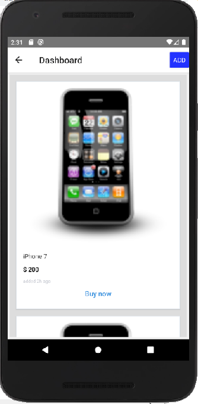

Concept :
> A mobile app to buy and sell used mobile phones.
> User can access the list available and can also post own requirements and devices.
> Authentication using userId+Password(now). gmail oAuth(future)
> Backend is dotnet REST api with Mongo DB

Device list display:

Install 
npx react-native run-android